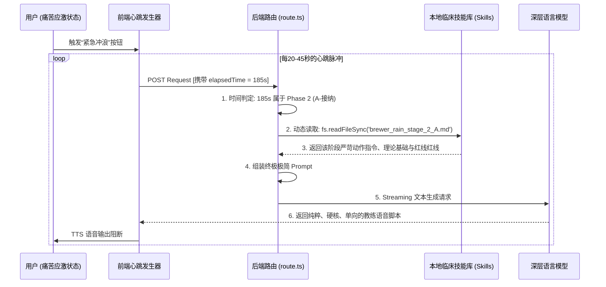

# 大模型动态临床技能注入架构：以“欲望冲浪 (Urge Surfing)”为例的理论与工程实践

## 一、 架构背景与核心痛点

在构建基于 LLM（大语言模型）的心理学/精神健康数字疗法产品时，我们面临一个核心痛点：**传统长文本 Prompt 的不可控性与幻觉流失**。

在应对如“突发成瘾发作、惊恐障碍”等极端应激场景中，治疗通常分为极其严格的阶段（如贾德森·布鲁尔构建的 RAIN 四步法）。如果将所有阶段的临床手册全部塞入唯一的系统提示词（System Prompt）中，大模型会出现：
1. **理论串台**：在 R（识别）阶段，大模型会因为在 Prompt 中看到了下一个阶段的知识，而“提前剧透”或跨步指导。
2. **指导失焦**：过长的大纲容易导致模型最终只会泛泛而谈（如“深呼吸就好”、“这一切会过去的”），丧失对具体肉体干预的物理级指导。
3. **高延迟的 Function Calling 陷阱**：使用主流的 Function Calling 让大模型自己决定是否查阅临床手册，会导致响应延迟翻倍，并在高频心跳轮询的急救场景中遭遇大模型“偷懒”不调用工具的风险。

## 二、 核心工作原理：高频心跳下的后台确定性强插引擎 (Deterministic Skill Injection)

为了解决以上痛点，本系统舍弃了“大语言模型自主判断（Agent Autonomy）”，转而采用**“时间序列驱动的后台强插架构”**。

1. **技能文件化 (Skills as Code)**：
   将特定的心理干预技术彻底拆解为独立的 Markdown 文件（如 `stage_1_recognize.md`），每个文件是提纯后的“单点微观教材”。
2. **阶段物理隔离 (Context Isolation)**：
   前端建立高频心跳轮询（如每秒请求一次生成流）。Node.js 后端根据当前经过的**生理时间窗（Elapsed Time）**计算所处阶段。
3. **零延迟热加载 (Zero-latency Loading)**：
   由于不依赖大模型的推理能力去判断当前阶段，后端直接通过瞬时硬盘读取（`fs.readFileSync`），将当前唯一需要的 Skill 文件塞入极简底层的 Prompt 中。此时，大模型在物理上只知道当前这一分钟的操作指南，从而彻底杜绝“理论串台”。

---

## 三、 动态心跳轮询系统流程图

---

## 四、 临床技能（Skill）提示词编写范式

本系统内每一份 Skill Markdown 文件的编写，必须严格遵循一种**“冷酷的临床降维架构”**。大模型并非心理医生，而是执行脚本的机器，因此不能给它提供宽泛的哲学理念，必须给出“肌肉级”的指令参数。

以当前项目中的 `brewer_rain_stage_3.md` (好奇探究) 为例，其构成如下：

1. **底层神经剖析（给大模型洗脑，确立基调）**：告诉模型多巴胺与好奇心在脑神经元中是不可共存的互斥状态。
2. **强制执行的台词范例（控制它的生成边界）**：约束它去使用高频词汇：解剖、微观、显微镜、边界、温度、呼吸起伏。
3. **绝对禁止（Redlines / Guardrails）**：通过“严禁追思创伤童年、严禁柔和的鸡汤”等断头台法则，防止模型的默认性格泛滥。

---

## 五、 后续延展：如何编写新的心理学干预 Skill？

除了布鲁尔的《欲望冲浪》，你完全可以通过这套引擎快速加装基于正规 CBT、DBT 或 MBC 理论的任意冥想干预模块。

以下是编写**【身体扫描 (Body Scan) 】**或**【呼吸正念 (Mindful Breathing)】**等新 Skill 时必须遵循的标准模板与心法：

### 编写新 Skill 的标准模板（以身体扫描为例）

未来，如果要求 AI 在项目中新增一个专门应对焦虑失眠的“系统性放松”技能（如 `skill_body_scan_insomnia.md`），导师和心理架构师可按照下述结构撰写该文件的内容：

#### 1. 定义大模型在当前阶段的【化身与隐喻】
> *（例如在冲浪里是冷酷大副，那么在身体扫描里，大模型应该是“一台冰冷精准的核磁共振探测仪”）*
- **编写要点**：直接第一句话指定角色：“你现在是一台扫描精细度达到微米的医疗探测雷达。你的声音要低沉、极其缓慢且具有深远的空间穿透感。”

#### 2. 定义其临床底层的【神经或生理机制】
> *（让 LLM 明白知其然及所以然，它会自动生成极高质的辅助文字）*
- **编写要点**：“失眠的核心是副交感神经系统无法接管身体。不要试图命令用户‘快点睡着’（这会激活皮层反弹）。告诉用户，我们不追求睡眠，我们追求对每一个肌肉纤维的彻底清查释放。”

#### 3. 制定【肌肉级别】的动作切片（核心骨架）
- **编写要点**：大模型最容易写出“感受你的下半身吧”这种无效引导。你必须亲自将动作拆解到骨骼。
- **示例台词指令集**：
  - *第一组要求*：“强行命令他把意识聚焦在脚趾，让他寻找空气流过脚趾缝隙的极其微弱的温度差。”
  - *第二组要求*：“引导他的注意力缓缓滑动到膝盖，探究膝盖骨内部犹如机械铰链发热般的沉重感。”
  - *第三组要求*：“要求他将背部肩胛骨深深地陷入床铺，让他想象这块骨头正在失去所有的分子密度，变得如液体般向床垫下渗透。”

#### 4. 设定生死的【红线红牌（Redlines）】
- **编写要点**：彻底堵死 LLM 惯常的“总结陈词”毛病。
- **红线范例**：
  - 绝对禁止：不要在段落结尾出现“愿你能马上拥抱美好的睡眠”、“祝你好梦”此类的惊扰性大声祝福。
  - 绝对禁止：不要问他“你现在感觉身体有变轻吗？”，不能使用任何引起用户逻辑思考的疑问句。

### 总结
这套架构的伟大之处在于：**“通过工程切片，对大模型实现了绝对的认知隔离”**。

在未来，心理学导师并不需要懂 TypeScript 和 Node.js 后端开发。导师只需要根据上述规范，像写 Word 课件一样写出一张张连贯的（Stage 1 至 Stage N）Markdown 文稿，工程师只需将文件拖入项目目录即可实现毫秒级响应、临床级别纯净、高语感浓度的沉浸式 AI 心理干预应用。
